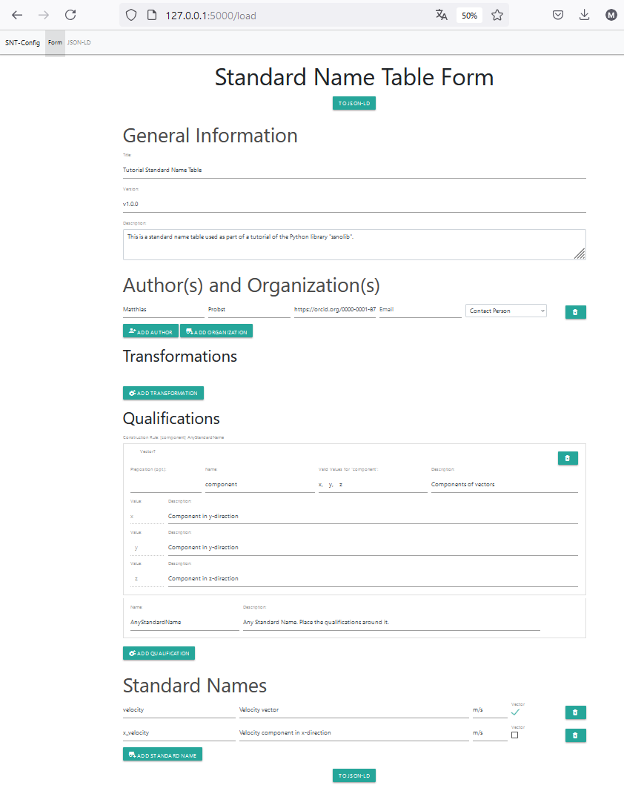

# ssnolib: Library for the Simple Standard Name Ontology (SSNO)


A Python library to work with the [SSNO ontology](https://matthiasprobst.github.io/ssno/1.5.1). It provides Python classes for ontology concepts and facilitates the creation of RDF files (JSON-LD, TTL, XML). RDF files are both human- and machine-readable, and most importantly, machine-actionable. The library can be integrated into your data (conversion) pipelines.

## Features
- Python classes for all SSNO ontology concepts
- Easy creation and export of JSON-LD, TTL, and XML files
- Support for Standard Name Tables (SNT)
- Extensible for HDF5, XML, and YAML formats
- Local web apps (Streamlit, Flask) for management and enrichment
- Compatible with Python 3.8–3.12
- Comprehensive documentation and tutorials

> **Note:** The library version matches the supported ontology version. For example, 1.5.0.1 refers to ontology version 1.5.0 and patch version .1 of the library.

## Installation

Install the core library:
```bash
pip install ssnolib
```

### Optional Extras
To use the local web app (Flask and/or HDF5):
```bash
pip install ssnolib[app,hdf]
```
To read Standard Name Tables in XML format:
```bash
pip install ssnolib[xml]
```
To read Standard Name Tables from YAML files:
```bash
pip install ssnolib[yaml]
```

## Quickstart

### Programmatic Usage
A Standard Name Table (SNT) defines Standard Names and exists as a RDF file 
(usually in TTL, XML, or JSON-LD format). The SNT itself is modeled by `ssnolib.StandardNameTable`. To 
reference it to the file (Distribution within a Dataset as per [DCAT](https://www.w3.org/TR/vocab-dcat-2/))
, you can use the following code:
```python
import ssnolib
from ssnolib.dcat import Dataset, Distribution

distribution = Distribution(
    title='TTL Table@en',
    downloadURL='https://example.org/cf-standard-name-table.ttl',
    mediaType='text/turtle'
)
snt_dataset = Dataset(
    title='CF Standard Name Table Dataset@en',
    description='The CF Standard Name Table is a controlled vocabulary for climate and forecast metadata.@en',
    distribution=distribution
)
snt = ssnolib.StandardNameTable(
    id="https://doi.org/10.5281/zenodo.12345678",
    title='CF Standard Name Table (latest version)@en',
    dataset=snt_dataset,
    created="2023-10-10",
)
```

The serialized version in TTL format can be obtained by:
```python
print(snt.serialize("ttl", base_uri="https://example.org#"))
```

which results in:
```turtle
@prefix dcat: <http://www.w3.org/ns/dcat#> .
@prefix dcterms: <http://purl.org/dc/terms/> .
@prefix ssno: <https://matthiasprobst.github.io/ssno#> .
@prefix xsd: <http://www.w3.org/2001/XMLSchema#> .

<https://doi.org/10.5281/zenodo.12345678> a ssno:StandardNameTable ;
    dcterms:created "2023-10-10"^^xsd:date ;
    dcterms:title "CF Standard Name Table (latest version)"@en ;
    ssno:dataset <https://example.org/#N00bb20ac7339453ebfe8d06d9c1b6f02> .

<https://example.org/#N00bb20ac7339453ebfe8d06d9c1b6f02> a dcat:Dataset ;
    dcterms:description "The CF Standard Name Table is a controlled vocabulary for climate and forecast metadata."@en ;
    dcterms:title "CF Standard Name Table Dataset"@en ;
    dcat:distribution <https://example.org/#N7f2b8ed9c2fb4e34bdd26250db3a6da6> .

<https://example.org/#N7f2b8ed9c2fb4e34bdd26250db3a6da6> a dcat:Distribution ;
    dcterms:title "TTL Table"@en ;
    dcat:downloadURL <https://example.org/cf-standard-name-table.ttl> ;
    dcat:mediaType <https://www.iana.org/assignments/media-types/text/turtle> .
   ```

### Web App Usage
There are two apps:
1. A Streamlit app to semantically enrich HDF5 files (requires `hdf` extra)
2. A Flask app to create and manage Standard Name Tables (requires `app` extra)

To start the GUI:
```bash
ssnolib --h5sn
```
or
```bash
ssnolib --app
```
This will start a local development server at `https://127.0.0.1:5000/`.

**Note:** The web app is work in progress. Do not expose it to the public. Feedback and contributions are welcome!



## Examples

### Standard Name Table to JSON-LD
```python
import ssnolib
from ssnolib.dcat import Distribution

distribution = Distribution(title='XML Table',
                            downloadURL='https://cfconventions.org/Data/cf-standard-names/current/src/cf-standard-name-table.xml',
                            mediaType='application/xml')
snt = ssnolib.StandardNameTable(
    id="_:standard_name_table_v79",
    title='CF Standard Name Table v79',
    distribution=[distribution]
)
with open('cf79.jsonld', 'w', encoding='utf-8') as f:
    f.write(snt.model_dump_jsonld(base_uri="https://local.org#"))
```

### Standard Name to JSON-LD
```python
import ssnolib

air_temp = ssnolib.StandardName(standardName='air_temperature',
                                canonicalUnits='K',
                                description='Air temperature is the bulk temperature of the air, not the surface (skin) temperature.')
with open('air_temperature.jsonld', 'w') as f:
    f.write(air_temp.model_dump_jsonld())
```

## Documentation
Find the online documentation [here](https://ssnolib.readthedocs.io/en/latest/), including rendered Jupyter Notebooks under `/docs/tutorials/` and API reference. Docstrings are available for all classes and methods.

## Project Structure
```
ssnolib/
    __init__.py
    cli.py
    dcat/
    hdf5/
    ssno/
    ...
docs/
    tutorials/
    ...
tests/
    ...
README.md
setup.py
requirements.txt
```

## Testing
To run tests:
```bash
pytest tests
```

## Contribution
Contributions are welcome! Please open an issue or pull request. Guidelines:
- Follow the [Code of Conduct](CODE_OF_CONDUCT.md) if available
- Write clear commit messages
- Add tests for new features
- Document changes in CHANGELOG.md

## Citation
Please cite this project using the [CITATION.cff](./CITATION.cff).

## License
This project is licensed under the [MIT License](./LICENSE).

## Support & Contact
- Report issues: [GitHub Issues](https://github.com/matthiasprobst/SSNOlib/issues)
- Questions & feedback: [matthias.probst@protonmail.com](mailto:matthias.probst@protonmail.com)
