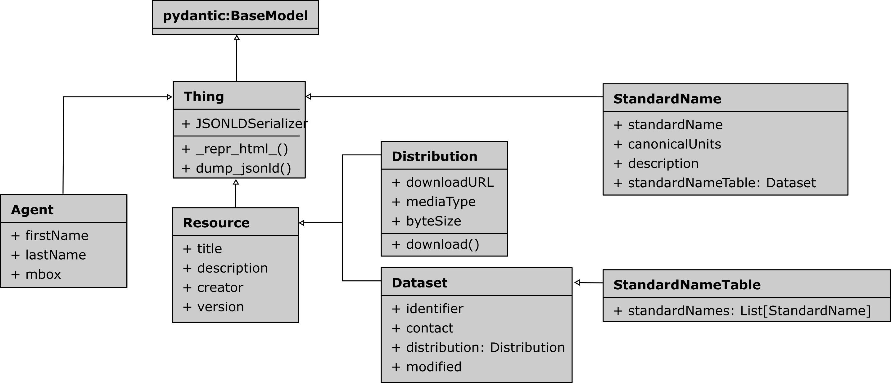

# sSNOlib


A Python library to work with the [sSNO ontology](https://matthiasprobst.github.io/ssno/). It provides Python classes
for the ontology classes and facilitates the creation of JSON-LD files. JSON-LD files are both human- and machine
readable and most importantly machine-actionable. The library can be integrated in you data (conversion) pipelines.

## Quickstart

With `ssnolib` you can create Standard Names and their tables quickly and easily. You can find Jupyter Lab Notebooks
explaining working with [Standard names here](docs/Standard%20Name.ipynb)
or [Standard Name Tables here](docs/StandardNameTable.ipynb).

The code below gives a quick insight using the *sSNOlib* classes:

```python
import ssnolib
from ssnolib.dcat import Distribution

distribution = Distribution(
    title='XML Table',
    download_URL='http://cfconventions.org/Data/cf-standard-names/current/src/cf-standard-name-table.xml',
    media_type='application/xml'
)
snt = ssnolib.StandardNameTable(title='CF Standard Name Table (latest version)',
                                distribution=distribution)
print(snt.model_dump_jsonld())
```

The last line dumps the object to a JSON-LD string:

```json
{
    "@context": {
        "owl": "http://www.w3.org/2002/07/owl#",
        "rdfs": "http://www.w3.org/2000/01/rdf-schema#",
        "dcat": "http://www.w3.org/ns/dcat#",
        "dcterms": "http://purl.org/dc/terms/",
        "prov": "http://www.w3.org/ns/prov#",
        "ssno": "https://matthiasprobst.github.io/ssno#"
    },
    "@type": "ssno:StandardNameTable",
    "@id": "_:Ncbf5f941ea5447aa9ce212a2bb8d0be2",
    "dcterms:title": "CF Standard Name Table (latest version)",
    "dcat:distribution": [
        {
            "@type": "dcat:Distribution",
            "@id": "_:Nce83c15ff61640e68ba4468ebf016787",
            "dcterms:title": "XML Table",
            "dcat:downloadURL": "http://cfconventions.org/Data/cf-standard-names/current/src/cf-standard-name-table.xml",
            "dcat:mediaType": "https://www.iana.org/assignments/media-types/application/xml"
        }
    ]
}
```

## Installation

```bash
pip install git+https://github.com/matthiasprobst/SSNOlib.git
```

To be able to read standard name tables in XML format (e.g. the cfconvetions.org standard name table), you need to add
the `xml` extra:

```bash
pip install git+https://github.com/matthiasprobst/SSNOlib.git[xml]
``` 

To be able to read standard name table from YAML files, you need to add the `yaml` extra:

```bash
pip install git+https://github.com/matthiasprobst/SSNOlib.git[yaml]
``` 

## Documentation

A complete documentation is still under development. However, the docstrings of the classes and methods should be
sufficient to get started. Also have a look at the [Tutorial Notebook](docs/Tutorial.ipynb) or following class diagram
and the [usage](#usage) examples below.



## Usage

Describe a Standard Name Table ith *sSNO*. Let's take the one from cfconventions.org as an example:

```python
import ssnolib
from ssnolib.dcat import Distribution

# Create a distribution object (downloadable XML file containing the standard name table)
distribution = Distribution(title='XML Table',
                                    download_URL='http://cfconventions.org/Data/cf-standard-names/current/src/cf-standard-name-table.xml',
                                    media_type='application/xml')

# Create a standard name table object
snt = ssnolib.StandardNameTable(title='CF Standard Name Table v79',
                                distribution=[distribution, ])

# To describe this standard name table, we can export the JSON-LD file:
with open('cf79.jsonld', 'w', encoding='utf-8') as f:
    f.write(snt.model_dump_jsonld())
```

The corresponding JSON-LD file looks like this (showing only 2 standard names for shortness):

```json
{
    "@context": {
        "owl": "http://www.w3.org/2002/07/owl#",
        "rdfs": "http://www.w3.org/2000/01/rdf-schema#",
        "dcat": "http://www.w3.org/ns/dcat#",
        "dcterms": "http://purl.org/dc/terms/",
        "prov": "http://www.w3.org/ns/prov#",
        "ssno": "https://matthiasprobst.github.io/ssno#"
    },
    "@type": "ssno:StandardNameTable",
    "@id": "_:N82e22ada2da9427fba343d0f978e98e9",
    "dcterms:title": "CF Standard Name Table v79",
    "dcat:distribution": [
        {
            "@type": "dcat:Distribution",
            "@id": "_:N8588e715cf1e4216ba142eea6f1b297d",
            "dcterms:title": "XML Table",
            "dcat:downloadURL": "http://cfconventions.org/Data/cf-standard-names/current/src/cf-standard-name-table.xml",
            "dcat:mediaType": "https://www.iana.org/assignments/media-types/application/xml"
        }
    ]
}
```

### Standard name to JSON-LD

```python
import ssnolib

air_temp = ssnolib.StandardName(standard_name='air_temperature',
                                canonical_units='K',
                                description='Air temperature is the bulk temperature of the air, not the surface (skin) temperature.')

# write to JSON-LD
with open('air_temperature.jsonld', 'w') as f:
    f.write(air_temp.model_dump_jsonld())
```

The corresponding JSON-LD file looks like this:

```json
{
    "@context": {
        "owl": "http://www.w3.org/2002/07/owl#",
        "rdfs": "http://www.w3.org/2000/01/rdf-schema#",
        "skos": "http://www.w3.org/2004/02/skos/core#",
        "ssno": "https://matthiasprobst.github.io/ssno#",
        "dcat": "http://www.w3.org/ns/dcat#"
    },
    "@type": "ssno:StandardName",
    "@id": "_:Naaf73045ffbe415f9ad28cc3daacd3e6",
    "ssno:canonicalUnits": "http://qudt.org/vocab/unit/K",
    "ssno:standardName": "air_temperature",
    "ssno:description": "Air temperature is the bulk temperature of the air, not the surface (skin) temperature."
}
```

You can now take the JSON-LD file and use it with your data (place it next to it, upload it to a server, etc.).

## Contribution

Contributions are welcome. Please open an issue or a pull request.

### Design of model classes

Attributes of the model classes should be the pref label as defined in the ontology. Underscores will be replaced with
spaces when dumping to JSON-LD files. E.g. `canonical_units` will be `canonical units`  or
`downloadURL` will be `download URL`  in the JSON-LD file.